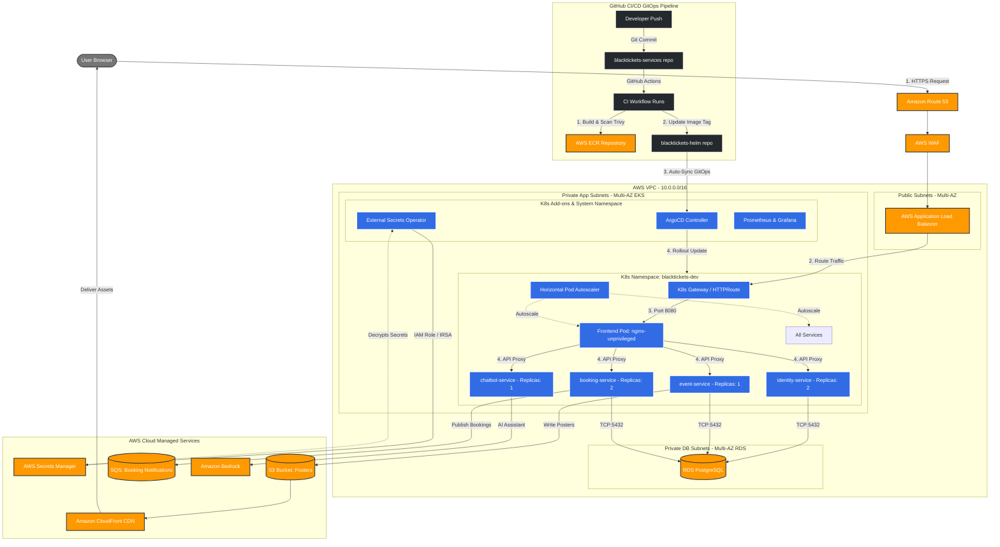

# BlackTickets Project Architecture

Here is the complete architecture diagram for your final capstone project. You can present this visual workflow to your mentors to demonstrate the system design.

