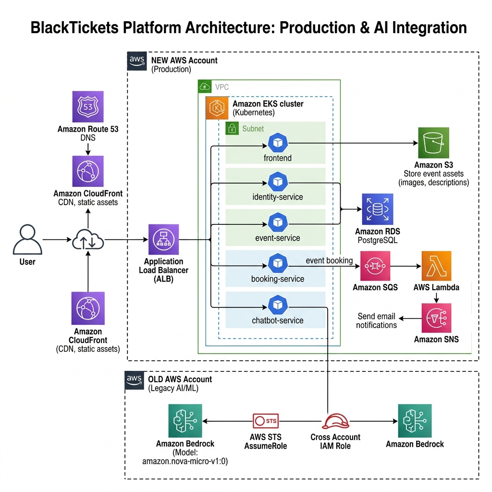

# BlackTickets AWS Cloud Architecture

Here is the professional AWS Cloud Architecture diagram for the production-grade **BlackTickets** platform. 

This diagram visualizes the flow of user traffic, the containerized microservices running inside Amazon EKS, the serverless notifications pipeline, and the secure cross-account IAM role assumption for AI features.

## 🖼️ Architecture Diagram



---

## 🔍 Detailed Component Flow

### 1. Ingress & Edge Routing
* **Route 53 DNS**: Resolves `blacktickets.ananthapps.site` and routes traffic globally.
* **CloudFront CDN**: Serves static frontend assets and caches static images from Amazon S3 (posters) at edge locations for ultra-low latency.
* **AWS WAF (Web Application Firewall)**: Attached to the ALB to inspect incoming HTTP/HTTPS headers and protect against SQL injections, XSS, and bot attacks.
* **AWS Application Load Balancer (ALB)**: Automatically provisioned by the **AWS Load Balancer Controller** inside EKS. Handles SSL termination using AWS ACM Certificates and routes traffic to EKS services.

### 2. Containerized Compute (Amazon EKS)
All services run in the `blacktickets-dev` namespace:
* **`frontend`**: React SPA hosted via an unprivileged Nginx server on port `8080`.
* **`identity-service`**: Handles user authentication and session management.
* **`event-service`**: Manages event CRUD operations. Uploads event poster images directly to **Amazon S3**.
* **`booking-service`**: Processes ticket transactions. Publishes notification payloads to **Amazon SQS**.
* **`chatbot-service`**: The AI booking assistant. Communicates with Bedrock via a secure cross-account pipeline.

### 3. Serverless Notification Pipeline
```
[booking-service] ──> [Amazon SQS Queue] ──> [AWS Lambda] ──> [Amazon SNS] ──> [User Email]
```
* **Amazon SQS**: Decouples booking confirmation logic from downstream email processing.
* **AWS Lambda**: Subscribes to the SQS queue, processes payloads, and triggers Amazon SNS.
* **Amazon SNS**: Sends SMS/Email confirmations back to users.

### 4. Database Layer
* **Amazon RDS (PostgreSQL)**: Deployed inside private DB subnets (unreachable from the internet). All microservices query RDS over port `5432` secured with Security Groups.

### 5. Secure Cross-Account Bedrock Integration (Special Architecture)
To access Amazon Bedrock from a different AWS account securely:
1. **`chatbot-service`** pod uses an EKS **ServiceAccount** annotated with an IAM Role (IRSA).
2. The pod requests temp credentials by calling **AWS STS AssumeRole** on a **Cross-Account IAM Role** located in the **OLD AWS Account**.
3. Once assumed, the chatbot communicates with the **Amazon Bedrock** API in the OLD Account using the `amazon.nova-micro-v1:0` model.
4. **No static access keys** are used, ensuring a 100% loosely coupled and compliant architecture.
