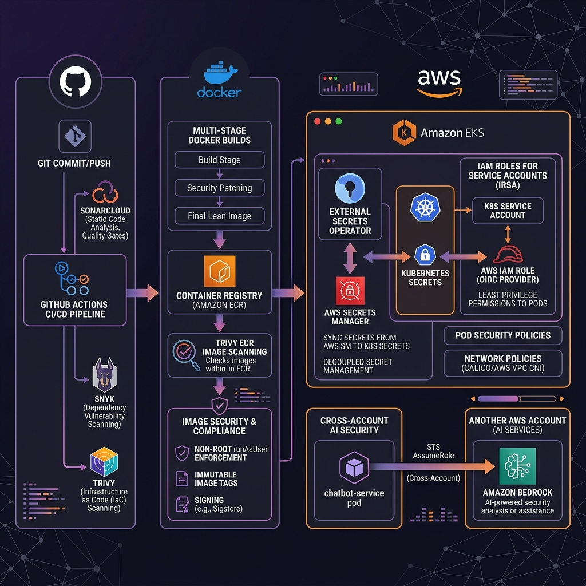

# BlackTickets DevSecOps Security Architecture

This document describes the layered, cloud-native **DevSecOps security architecture** implemented for the **BlackTickets** platform. The architecture follows the "Shift-Left" security model, securing code, dependencies, containers, secrets, infrastructure, and cross-account integrations.

---

## DevSecOps Security Architecture Diagram



---

## 1. Pipeline Security (Shift-Left)

Security checks are baked directly into the GitHub Actions CI/CD pipeline before any code is built or deployed:

* **Static Application Security Testing (SAST)**: **SonarCloud** scans code pushes for bugs, code smells, vulnerabilities, and security hotspots (e.g., hardcoded values, weak algorithms).
* **Software Composition Analysis (SCA)**: **Snyk** checks npm dependencies for known vulnerabilities and licenses issues, blocking builds with critical security issues.
* **Infrastructure as Code (IaC) Scanning**: **Trivy** scans Terraform configuration files locally and in CI to identify IAM misconfigurations, wide-open security groups, and unencrypted resource deployments.

---

## 2. Container & Registry Security

Once code passes scanning, containerization rules ensure minimal attack surfaces:

* **Multi-Stage Builds**: Dockerfiles utilize multi-stage builds. The final production image only copies the compiled build output and necessary production dependencies, omitting build tools (like npm or compilers) and development libraries.
* **Non-Root Execution**: Container runtimes are locked down in Kubernetes. Images run with a non-privileged user:
  ```yaml
  securityContext:
    runAsNonRoot: true
    runAsUser: 1000
    allowPrivilegeEscalation: false
  ```
* **ECR Image Scanning**: Amazon ECR scans images on push to detect OS-level libraries containing vulnerabilities, enabling alerts on new CVEs.

---

## 3. Secrets Management (Zero Hardcoded Credentials)

No database passwords, JWT tokens, or credentials reside in the git repositories. Secrets flow dynamically:

```
[ AWS Secrets Manager ] ──(Secure Sync)──► [ External Secrets Operator ] ──(In-Memory Sync)──► [ Kubernetes Secret ] ──(Environment Injection)──► [ Microservice Pods ]
```

1. **AWS Secrets Manager**: Serves as the single source of truth for secret storage (encrypted via KMS).
2. **External Secrets Operator (ESO)**: Runs in EKS under a specific IAM Role (via IRSA) allowing it to read only the `blacktickets-dev/app-config` secret.
3. **Dynamic In-Memory Sync**: ESO automatically extracts the secret fields and writes them as native Kubernetes `Secret` objects in the `blacktickets-dev` namespace.
4. **Environment Injection**: Pods consume these secrets dynamically as environment variables without writing them to disk.

---

## 4. Cloud & EKS Runtime Security (IRSA)

The architecture completely deprecates long-lived AWS IAM Access Keys and Secret Keys. All access is governed by **IAM Roles for Service Accounts (IRSA)**:

* **OpenID Connect (OIDC) Federation**: The EKS cluster functions as an OIDC Identity Provider trusted by AWS IAM.
* **Service Account Mapping**: Kubernetes Pods are associated with a `ServiceAccount` annotated with the target AWS IAM Role ARN:
  ```yaml
  apiVersion: v1
  kind: ServiceAccount
  metadata:
    name: booking-service
    annotations:
      eks.amazonaws.com/role-arn: arn:aws:iam::541341197012:role/blacktickets-dev-booking-service-irsa
  ```
* **Least Privilege**: Each microservice has a dedicated IAM role. For example, `event-service` only has access to write to the posters S3 bucket, and `booking-service` only has access to publish messages to the SQS queue.

---

## 5. Cross-Account AI Security (Temporary Bedrock Credentials)

To access Amazon Bedrock Nova models located in a separate (or office/old) AWS account, a secure, credential-less trust relation is used:

```
                                [ EKS Pod (Account A) ]
                                           │
                                           ▼ (Presents OIDC Token)
                        [ chatbot-service-irsa Role (Account A) ]
                                           │
                                           ▼ (Calls sts:AssumeRole)
                        [ cross-account-bedrock Role (Account B) ]
                                           │
                                           ▼ (Temporary Session)
                              [ Amazon Bedrock (Account B) ]
```

1. The `chatbot-service` Pod uses EKS OIDC to assume its local IAM role `blacktickets-dev-chatbot-service-irsa` (Account A).
2. The local role performs an **AWS STS `AssumeRole`** call targeting the cross-account role in Account B.
3. AWS STS returns temporary, short-lived security credentials (valid for 1 hour) allowing the chatbot pod to call Bedrock directly.
4. No keys are ever written to the repository or stored in the EKS environment.
