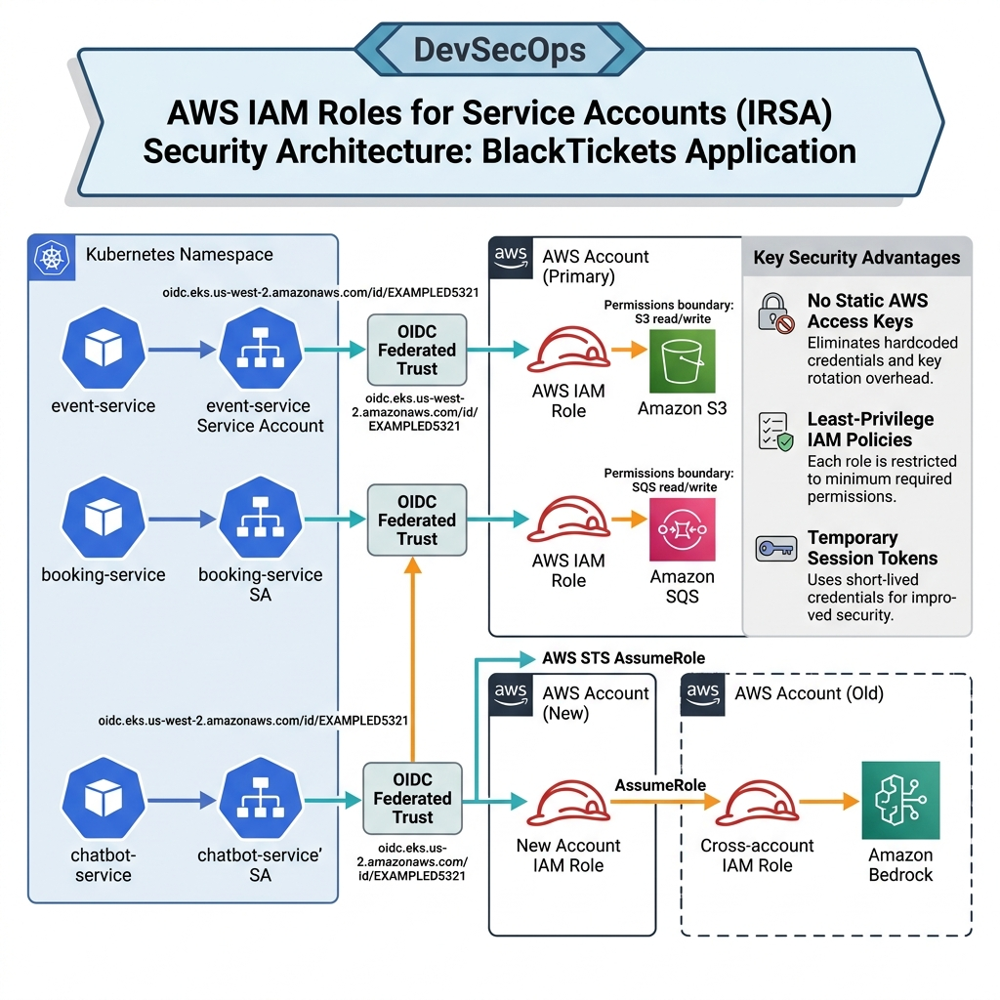

# BlackTickets IAM Roles for Service Accounts (IRSA) Security Architecture

Here is the professional **IRSA Security Architecture** diagram for the **BlackTickets** application. 

This diagram explains the secure, keyless authentication model used by your microservices to interact with AWS resources.

## 🔐 Security Architecture Diagram

---

## 🔍 Security Principles & Mappings

### 1. The Core Security Mechanics
* **No Access Keys**: Traditionally, applications in containers required static `AWS_ACCESS_KEY_ID` and `AWS_SECRET_ACCESS_KEY` secrets, which pose a major leak risk. Your project uses **zero static keys**.
* **OIDC Identity Provider**: The EKS cluster has an associated OpenID Connect (OIDC) identity provider. AWS IAM trusts this OIDC provider.
* **Temporary Credentials**: When a pod starts, EKS automatically mounts a projected web identity token file. The AWS SDK reads this token and calls **AWS STS** (Security Token Service) to obtain temporary credentials valid for 1 hour.

### 2. Service Security Mappings
* **Event Service (Catalog Management)**:
  * `event-service` Pod ──> ServiceAccount (`event-service`) ──> IAM Role (`event-service-irsa`) ──> **S3 Bucket (Read/Write)**
* **Booking Service (Transaction Processing)**:
  * `booking-service` Pod ──> ServiceAccount (`booking-service`) ──> IAM Role (`booking-service-irsa`) ──> **SQS Queue (Publish Messages)**
* **Chatbot Service (Cross-Account AI Integration)**:
  * `chatbot-service` Pod ──> ServiceAccount (`chatbot-service`) ──> IAM Role in **New Account** (`chatbot-service-irsa`) ──> Calls **STS AssumeRole** ──> Assumes Cross-Account IAM Role in **Old Account** ──> **Amazon Bedrock (Nova Model)**
