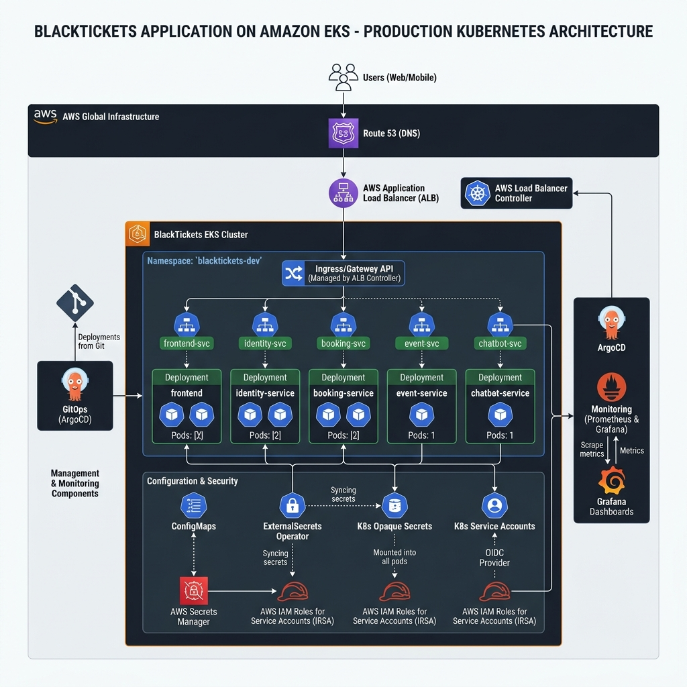

# BlackTickets Kubernetes (EKS) Architecture

Here is the production-grade **Kubernetes EKS Cluster Architecture** diagram for the **BlackTickets** application. 

This diagram highlights the internal pod counts, Kubernetes controllers (External Secrets, Gateway API, AWS Load Balancer Controller), and administrative tools (ArgoCD, Prometheus, Grafana).

## ☸️ Kubernetes Cluster Diagram

---

## 🔍 Key Architectural Details

### 1. Ingress & Traffic Management
* **AWS Load Balancer Controller**: Deployed in the cluster. It watches for `Gateway` and `HTTPRoute` resources to provision and configure the external AWS Application Load Balancer.
* **Gateway API**:
  * **Gateway Resource**: Binds the certificate and defines entry points.
  * **HTTPRoute**: Maps `/api/auth` -> `identity-service`, `/api/bookings` -> `booking-service`, and `/` -> `frontend`.
* **Services**: Internal `ClusterIP` Services load-balance traffic across active pod replicas.

### 2. Dev Namespace Deployments (`blacktickets-dev`)
* **`frontend`** (2 Pods): Serves the web assets.
* **`identity-service`** (2 Pods): Handles user accounts and authentication.
* **`booking-service`** (2 Pods): Handles reservations and payments.
* **`event-service`** (1 Pod): Handles catalog management.
* **`chatbot-service`** (1 Pod): Serves AI requests.

### 3. Configuration & Secret Management
* **ConfigMap**: Holds non-sensitive env variables (endpoints, region configurations).
* **External Secrets Operator**: Syncs AWS Secrets Manager keys down into Kubernetes as standard **K8s Secrets** (Opaque).
* **Service Accounts (IRSA)**: Kubernetes Service Accounts map directly to IAM roles on AWS using OIDC annotations (e.g. `eks.amazonaws.com/role-arn`), allowing pods to assume roles without access keys.

### 4. Supporting Tooling
* **ArgoCD**: Pulls state from Git (`blacktickets-helm` repo) and continually matches it to the running cluster.
* **Prometheus & Grafana**: Automatically scrape and visualize container and node metrics.
