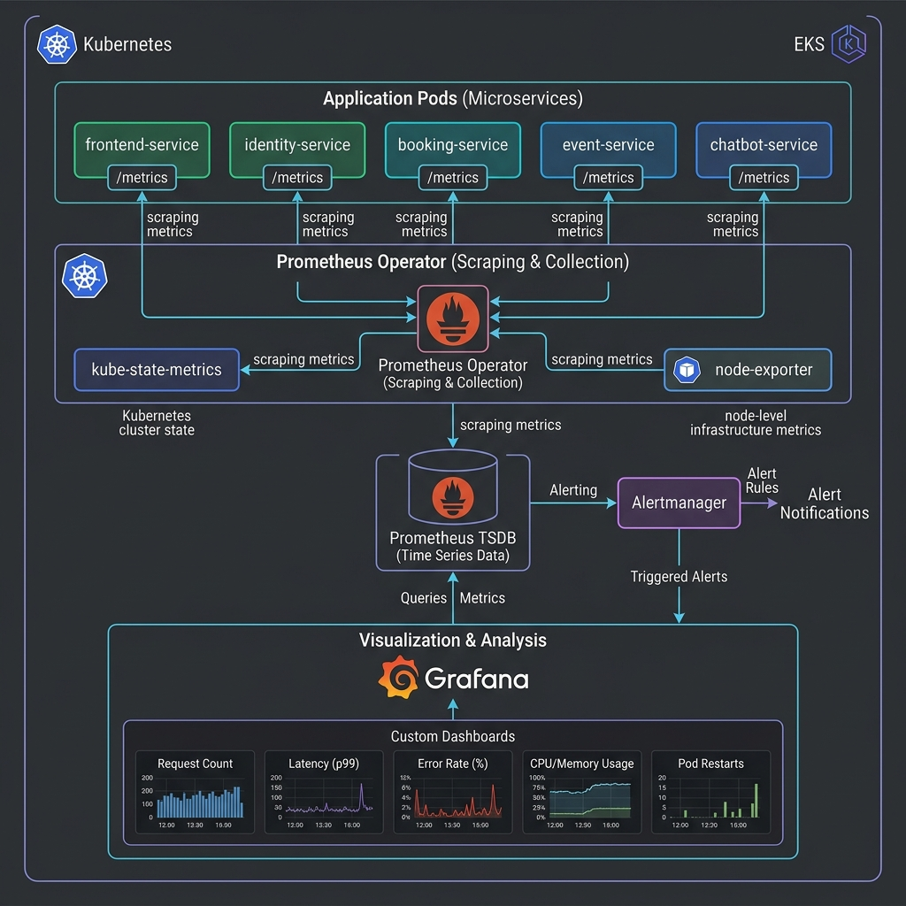
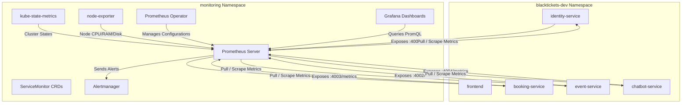

# BlackTickets Kubernetes Observability Architecture

This document describes the production-grade Kubernetes monitoring and observability architecture for the **BlackTickets** event booking platform deployed on Amazon EKS.

---

## Observability Architecture Diagram



---

## 1. Metrics Collection Flow

The monitoring system leverages a pull-based metrics collection architecture orchestrated by the **Prometheus Operator**:



### Scraping Protocol
1. **Application Pods**: The microservices expose standardized raw metrics in the openmetrics format on their respective `/metrics` endpoints.
2. **ServiceMonitor Custom Resource (CRD)**: The Prometheus Operator dynamically discovers targets using labels. A `ServiceMonitor` matches pods with the label `app.kubernetes.io/part-of: blacktickets` and target ports:
   * `identity-service`: port `4001`
   * `event-service`: port `4002`
   * `booking-service`: port `4003`
   * `chatbot-service`: port `4004`
3. **Scrape Interval**: Set to `15s` in production to capture fast performance spikes and micro-outages without overwhelming the storage engine.

---

## 2. Infrastructure Monitoring Components

In addition to application metrics, the architecture deploys standard exporters to collect node and cluster health details:

| Component | Target Metrics | Scraping Target |
| :--- | :--- | :--- |
| **Node Exporter** | Host-level hardware metrics (CPU load, memory usage, network throughput, disk I/O, disk capacity) | Deployed as a `DaemonSet` on every EKS EC2 node. |
| **Kube-State-Metrics** | Kubernetes object state metrics (pod restarts, replica counts, node capacity, deployment statuses, PVC usage) | Deployed as a single replica `Deployment`. |
| **CoreDNS & Kubelet** | Internal cluster DNS health, latency, API server health, and pod runtime stats | Scraped directly from control plane components. |

---

## 3. Grafana Enterprise Dashboards

Grafana connects to Prometheus as its primary datasource, providing unified, real-time visualization of the platform's health. The dashboards are segmented into three operational views:

### A. Application Dashboards (RED Method)
* **Rate**: Total request counts per microservice (HTTP request rates per second).
* **Errors**: HTTP 5xx error rates, database connection drops, and service communication failures.
* **Duration**: Latency percentiles ($p50, p90, p99$) for API calls.

### B. Kubernetes System Dashboards (USE Method)
* **Utilization**: CPU and Memory consumption per pod/namespace relative to configured requests and limits.
* **Saturation**: Pod memory usage approaching limits (warning of Out-Of-Memory (OOM) kills).
* **Errors & Restarts**: Pod restart loops (`CrashLoopBackOff` counts), unready replica alerts.

### C. Business Dashboards
* Active booking sessions, tickets booked per minute, queue depth of the Booking SQS Queue, and Bedrock token usage tracking.

---

## 4. Alerting Pipeline

The alerting rules are defined declaratively as `PrometheusRule` objects managed by the Operator, routing issues to **Alertmanager** for deduping and notifications:

```
[ EKS Pod Failure / High Latency ]
               │
               ▼ (Rule evaluates)
    [ Prometheus Server ]
               │
               ▼ (Active Alert)
      [ Alertmanager ]
         ├── Deduplicate & Group
         └── Route to Destinations
               ├── PagerDuty / OpsGenie (Critical Alerts)
               ├── Slack Channels (#ops-alerts)
               └── Email / SNS Notifications
```

### Production Alerting Rules Examples:
* **`PodRestartsTooFrequent`**: Alerts if a pod restarts more than 5 times in 10 minutes (detecting CrashLoops).
* **`ServiceHighLatency`**: Alerts if HTTP response latency ($p95$) exceeds `800ms` over a 5-minute sliding window.
* **`SQSQueueBackup`**: Alerts if SQS `ApproximateNumberOfMessagesVisible` exceeds `50` (consumer lag).
* **`RDSStorageLow`**: Alerts if RDS PostgreSQL storage space falls below `5 GB`.
