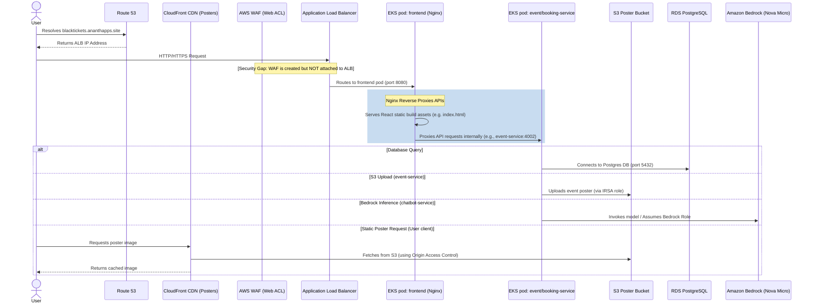

# BlackTickets Architecture & Infrastructure Discovery Report

This report presents a senior DevOps/cloud engineering analysis of the **BlackTickets** platform codebase, covering repository structure, microservices, containerization, Terraform configurations, CI/CD pipelines, Kubernetes manifests, secrets management, observability, and security analysis.

---

## 1. Repository Structure Summary

The workspace is organized into three major subprojects:

1. **`blacktickets-services`** ([blacktickets-services](file:///d:/project/blacktickets-final/blacktickets-services)): Contains the application microservices (frontend + backend) and the Docker Compose setup for local development.
2. **`blacktickets-infra`** ([blacktickets-infra](file:///d:/project/blacktickets-final/blacktickets-infra)): Contains the Terraform code for provisioning AWS resources, Lambda function source code, and seeding/bootstrap scripts.
3. **`blacktickets-helm`** ([blacktickets-helm](file:///d:/project/blacktickets-final/blacktickets-helm)): Contains the Helm charts and value files used by ArgoCD to deploy the application services onto the EKS cluster.

### Evidence (Files Checked):
- Root workspace directory: [blacktickets-final](file:///d:/project/blacktickets-final)
- Services folder: [blacktickets-services](file:///d:/project/blacktickets-final/blacktickets-services)
- Infrastructure folder: [blacktickets-infra](file:///d:/project/blacktickets-final/blacktickets-infra)
- Helm charts folder: [blacktickets-helm](file:///d:/project/blacktickets-final/blacktickets-helm)

---

## 2. Application Services and Purpose

The application is split into 5 core services:

| Service Name | Path | Tech Stack | Purpose |
| :--- | :--- | :--- | :--- |
| **`frontend`** | [frontend](file:///d:/project/blacktickets-final/blacktickets-services/frontend) | React, Vite, Nginx | The user interface. Served by Nginx, it also acts as the API gateway by reverse-proxying `/api/*` endpoints internally. |
| **`identity-service`** | [identity-service](file:///d:/project/blacktickets-final/blacktickets-services/identity-service) | Node.js, Express, pg | Manages user registration, login, JWT issuance, and seeds admin/user credentials into the database. |
| **`event-service`** | [event-service](file:///d:/project/blacktickets-final/blacktickets-services/event-service) | Node.js, Express, pg, S3 Client | Manages the event catalog, tracks seat availability, and handles event poster image uploads to S3. |
| **`booking-service`** | [booking-service](file:///d:/project/blacktickets-final/blacktickets-services/booking-service) | Node.js, Express, pg, SQS Client | Processes ticket bookings, updates seats via the `event-service`, writes to DB, and sends events to SQS. |
| **`chatbot-service`** | [chatbot-service](file:///d:/project/blacktickets-final/blacktickets-services/chatbot-service) | Node.js, Express, Bedrock Client | An AI booking assistant that uses Amazon Bedrock (`nova-micro`) to parse user messages, fetch events, and trigger bookings. |

### Evidence (Files Checked):
- Services definitions and README: [blacktickets-services/README.md](file:///d:/project/blacktickets-final/blacktickets-services/README.md)
- Microservices directories:
  - Frontend: [frontend/Dockerfile](file:///d:/project/blacktickets-final/blacktickets-services/frontend/Dockerfile)
  - Identity Service: [identity-service/package.json](file:///d:/project/blacktickets-final/blacktickets-services/identity-service/package.json)
  - Event Service: [event-service/package.json](file:///d:/project/blacktickets-final/blacktickets-services/event-service/package.json)
  - Booking Service: [booking-service/package.json](file:///d:/project/blacktickets-final/blacktickets-services/booking-service/package.json)
  - Chatbot Service: [chatbot-service/package.json](file:///d:/project/blacktickets-final/blacktickets-services/chatbot-service/package.json)

---

## 3. Docker / Docker Compose Flow

Local integration testing is configured via a multi-container Docker Compose setup.

- **Orchestration**: The `docker-compose.yml` launches a single PostgreSQL instance (`ticketing-postgres`) alongside the 5 microservices.
- **Reverse Proxy**: An outer `nginx` service binds host ports `80` and `443` and handles request forwarding.
- **Port Mapping**:
  - `nginx`: `80:80`, `443:443`
  - `frontend`: `5173:80` (internal only, maps to internal port 80/8080)
  - `identity-service`: `4001:4001`
  - `event-service`: `4002:4002`
  - `booking-service`: `4003:4003`
  - `chatbot-service`: `4004:4004`
- **Dependencies**: Startups are serialized using Docker Compose `depends_on` healthchecks (services wait until `postgres` and prerequisite APIs report healthy via `pg_isready` and Node process checks).
- **Bedrock Local Credentials**: The `chatbot-service` mounts the host's AWS folder `~/.aws` to `/root/.aws:ro` to invoke Bedrock.

### Evidence (Files Checked):
- Local compose config: [docker-compose.yml](file:///d:/project/blacktickets-final/blacktickets-services/docker-compose.yml)
- Frontend Nginx config for local: [frontend/nginx/local.conf](file:///d:/project/blacktickets-final/blacktickets-services/frontend/nginx/local.conf)

---

## 4. Terraform Infrastructure Components

The infrastructure is modularized and deployed via Terraform:

| Module | Source Directory | Key Resources Managed |
| :--- | :--- | :--- |
| **`github_oidc`** | `modules/oidc` | IAM OpenID Connect provider for passwordless GitHub Actions deployments. |
| **`networking`** | `modules/networking` | VPC, Internet Gateway, NAT Gateway, Public Subnets (2), Private Application Subnets (2), Private Database Subnets (2). |
| **`security`** | `modules/security` | EKS Control Plane Security Group, RDS Postgres Security Group. |
| **`ecr`** | `modules/ecr` | ECR Repositories for all 5 services. |
| **`data`** | `modules/data` | Private RDS Postgres, S3 Poster Bucket, SQS Booking Queue, SNS Topic (with email subscription), AWS Secrets Manager secret, and Lambda consumer function. |
| **`eks`** | `modules/eks` | Managed EKS Cluster (Kubernetes 1.31) and EKS Node Group (`t3.medium` instances in Private subnets). |
| **`irsa`** | `modules/irsa` | IAM Roles for EKS Service Accounts (S3 access, SQS access, Bedrock invoke/assume, Secrets Manager access, ALB controller access). |
| **`platform_addons`** | `modules/platform-addons` | Gateway API CRDs, AWS Load Balancer Controller (with ALB Gateway API enabled), External Secrets Operator, Kubernetes Metrics Server. |
| **`argocd`** | `modules/argocd` | ArgoCD installation (Helm) and the bootstrap application syncing `blacktickets-helm`. |
| **`edge`** | `modules/edge` | Route53 Zones, Record Sets, ACM Certificate validation, CloudFront Distribution (OAC secured for S3 poster access), and regional WAF Web ACL. |
| **`observability`** | `modules/observability` | CloudWatch Dashboard, CloudWatch Metric Alarms, and CloudTrail stream for audit logging. |
| **`monitoring`** | `modules/monitoring` | Prometheus Stack (deploys `kube-prometheus-stack`), AWS EBS CSI driver and gp3 StorageClass (`ebs-sc`), Grafana Dashboard configmaps. |

### Evidence (Files Checked):
- Main Terraform entry: [terraform/main.tf](file:///d:/project/blacktickets-final/blacktickets-infra/terraform/main.tf)
- Provider definitions: [terraform/provider.tf](file:///d:/project/blacktickets-final/blacktickets-infra/terraform/provider.tf)
- Module definitions: [terraform/modules/](file:///d:/project/blacktickets-final/blacktickets-infra/terraform/modules)

---

## 5. AWS Architecture Flow (User Request to DB)

Below is the request cycle for the application in AWS EKS:



---

## 6. AWS Service Usage Deep-Dive

### WAF
- **Resource**: `aws_wafv2_web_acl.regional` (`Scope = REGIONAL`)
- **Rules**: Contains `AWSManagedRulesCommonRuleSet`, `AWSManagedRulesSQLiRuleSet`, and a rate-limiting rule (`RateLimit100` blocking client IPs exceeding 100 requests in 5 minutes).
- **Evidence**: [edge/main.tf:L91-183](file:///d:/project/blacktickets-final/blacktickets-infra/terraform/modules/edge/main.tf#L91-183)

### CloudFront
- **Resource**: `aws_cloudfront_distribution.posters`
- **OAC Security**: Integrates with Origin Access Control (`aws_cloudfront_origin_access_control.posters`) to fetch objects securely from a private S3 bucket.
- **Routing**: Restricts public bucket access; browsers pull poster images via the CloudFront distribution domain.
- **Evidence**: [edge/main.tf:L15-63](file:///d:/project/blacktickets-final/blacktickets-infra/terraform/modules/edge/main.tf#L15-63)

### Application Load Balancer (ALB)
- **Provisioning**: Managed dynamically by the AWS Load Balancer Controller inside EKS using Kubernetes Gateway API.
- **Configuration**: Uses Gateway API `GatewayClass` `alb` and `LoadBalancerConfiguration` to spin up an internet-facing ALB mapping to EKS Service pods.
- **Evidence**: [platform-addons/main.tf:L128-160](file:///d:/project/blacktickets-final/blacktickets-infra/terraform/modules/platform-addons/main.tf#L128-160), [blacktickets/templates/gateway.yaml](file:///d:/project/blacktickets-final/blacktickets-helm/charts/blacktickets/templates/gateway.yaml)

### S3
- **Posters Bucket**: `aws_s3_bucket.posters` (`blacktickets-dev-posters`). Private access block enabled (`aws_s3_bucket_public_access_block`). Allows reads from CloudFront OAC.
- **CloudTrail Logs Bucket**: `aws_s3_bucket.cloudtrail_logs` stores CloudTrail audit logs.
- **Evidence**: [data/main.tf:L44-94](file:///d:/project/blacktickets-final/blacktickets-infra/terraform/modules/data/main.tf#L44-94), [observability/main.tf:L213-254](file:///d:/project/blacktickets-final/blacktickets-infra/terraform/modules/observability/main.tf#L213-254)

### SQS
- **Resource**: `aws_sqs_queue.booking_notifications` (`blacktickets-dev-booking-notifications`).
- **Flow**: When a user books tickets, the `booking-service` pushes a JSON payload onto this queue. It has a visibility timeout of 30 seconds.
- **Evidence**: [data/main.tf:L96-105](file:///d:/project/blacktickets-final/blacktickets-infra/terraform/modules/data/main.tf#L96-105), [booking-service/src/services/notificationQueue.js](file:///d:/project/blacktickets-final/blacktickets-services/booking-service/src/services/notificationQueue.js)

### SNS
- **Resource**: `aws_sns_topic.booking_notifications`.
- **Subscription**: Configures email subscription endpoint defined by `var.notification_email`.
- **Evidence**: [data/main.tf:L107-119](file:///d:/project/blacktickets-final/blacktickets-infra/terraform/modules/data/main.tf#L107-119)

### Lambda
- **Resource**: `aws_lambda_function.booking_notification_consumer` (`blacktickets-dev-booking-notification-consumer`).
- **Handler**: Node.js runtime (`nodejs20.x`).
- **Trigger**: SQS queue via `aws_lambda_event_source_mapping`.
- **Action**: Receives messages, parses details, formats emails, and publishes to the SNS Topic.
- **Evidence**: [data/main.tf:L130-244](file:///d:/project/blacktickets-final/blacktickets-infra/terraform/modules/data/main.tf#L130-244), [lambda/booking-notification-consumer/index.js](file:///d:/project/blacktickets-final/blacktickets-infra/lambda/booking-notification-consumer/index.js)

### RDS
- **Resource**: `aws_db_instance.postgres` (`blacktickets-dev-postgres`).
- **Engine**: PostgreSQL 16. Implemented in private DB subnets, inaccessible directly from the internet.
- **Database Names**: Holds `identity_db`, `event_db`, and `booking_db` databases.
- **Evidence**: [data/main.tf:L12-42](file:///d:/project/blacktickets-final/blacktickets-infra/terraform/modules/data/main.tf#L12-42), [security/main.tf:L38-69](file:///d:/project/blacktickets-final/blacktickets-infra/terraform/modules/security/main.tf#L38-69)

---

## 7. CI/CD Files and Deployment Flow

### Reusable Workflow: `ci-template.yml`
Handles standard testing, quality gates, image packaging, vulnerability scanning, and deployment tag updates.
1. **Quality Phase**:
   - Runs `npm ci`, `npm run build` (if exists), `npm test` (if exists).
   - Audits package dependencies using `npx depcheck`.
   - Performs Snyk dependency scan (if token configured).
   - Triggers SonarQube code scanning (if token configured).
2. **Build and Scan Phase**:
   - Assumes AWS ECR Push Role via OIDC (`configure-aws-credentials`).
   - Resolves Versioning: Pushes `vX.Y.Z` and `prod` tags for `main` branch, or `dev-${GITHUB_SHA}` and `dev` for other branches.
   - Builds Docker image and scans it using **Trivy**. Trivy vulnerabilities fail build on `main` branch (exit code 1) but pass on `dev` (exit code 0).
   - Pushes Docker tags to Amazon ECR.
3. **Deployment Tag Phase**:
   - Checks out the `blacktickets-helm` repository.
   - Uses `yq` to update the service's tag value inside the Helm chart's environment values files:
     - `charts/blacktickets/values-prod.yaml` (for `main` branch pushes)
     - `charts/blacktickets/values-dev.yaml` (for `dev` branch pushes)
   - Commits and pushes changes back to the Helm repo using a git rebase retry loop (up to 5 attempts) to prevent race conditions during parallel pipelines.

### Infrastructure Deployments: `terraform.yml`
- Deploys Terraform config automatically when code under `terraform/**` changes.
- Uses GitHub OIDC to authenticate, validates files, plans, and writes comments back to pull requests. On pushes to `main`, it runs `terraform apply -auto-approve`.

### Evidence (Files Checked):
- Service CI template: [ci-template.yml](file:///d:/project/blacktickets-final/blacktickets-services/.github/workflows/ci-template.yml)
- Service triggers: [ci-frontend.yml](file:///d:/project/blacktickets-final/blacktickets-services/.github/workflows/ci-frontend.yml), [ci-identity-service.yml](file:///d:/project/blacktickets-final/blacktickets-services/.github/workflows/ci-identity-service.yml)
- Terraform workflow: [terraform.yml](file:///d:/project/blacktickets-final/blacktickets-infra/.github/workflows/terraform.yml)

---

## 8. Kubernetes / EKS / Helm / ArgoCD Setup

### Kubernetes Enforcements (Helm Templates)
- **`deployment.yaml`**: Standard pod definitions mapping containers to respective ECR images. Sets up liveness and readiness HTTP probes on `/health` (except frontend on `/`), injects resource limits (requests: `100m` CPU / `128Mi` RAM; limits: `500m` CPU / `256Mi` RAM), and defines security contexts.
- **`gateway.yaml` / `httproute.yaml`**: Uses AWS Gateway API controllers to expose the platform. Maps ingress `/` directly to the `frontend` service (port 80).
- **`networkpolicy.yaml`**: Restricts pod communications (Zero-Trust). Employs `default-deny-ingress` to drop traffic. Allows ingress to individual services only from authorized routes (e.g. only `frontend` and `chatbot-service` can query `booking-service`).
- **`hpa.yaml`**: Autoscaling configured. Scales deployment replicas between 1 and 3 pods based on a target CPU utilization of 70%.

### GitOps Flow (ArgoCD & Helm)
- ArgoCD is bootstrapped on EKS inside namespace `argocd` via Terraform.
- A custom `Application` named `blacktickets` is created pointing to `blacktickets-helm.git` (path: `charts/blacktickets`).
- Updates to `values-dev.yaml` or `values-prod.yaml` by the CI template trigger ArgoCD to sync EKS deployments to the ECR tags in the values file.

### Evidence (Files Checked):
- Helm chart values: [values.yaml](file:///d:/project/blacktickets-final/blacktickets-helm/charts/blacktickets/values.yaml)
- Helm templates: [templates/deployment.yaml](file:///d:/project/blacktickets-final/blacktickets-helm/charts/blacktickets/templates/deployment.yaml), [templates/networkpolicy.yaml](file:///d:/project/blacktickets-final/blacktickets-helm/charts/blacktickets/templates/networkpolicy.yaml), [templates/gateway.yaml](file:///d:/project/blacktickets-final/blacktickets-helm/charts/blacktickets/templates/gateway.yaml)
- ArgoCD module: [argocd/main.tf](file:///d:/project/blacktickets-final/blacktickets-infra/terraform/modules/argocd/main.tf)

---

## 9. Secrets and Configuration Strategy

The application configuration isolates environmental config from application secrets:

- **Non-secret configs**: Stored inside a Kubernetes `ConfigMap` named `blacktickets-config`. Configured with DB hosts, queue URLs, bucket names, and microservice HTTP endpoints.
- **Secrets Management (External Secrets Operator)**:
  - Secrets (e.g., database password, JWT secret, session tokens) are stored in AWS Secrets Manager as a single JSON object under the name `${project_name}-${environment}/app-config`.
  - The External Secrets Operator runs in EKS under the `external-secrets` namespace, authorized by an IRSA role (`external-secrets-irsa`).
  - A `ClusterSecretStore` connects EKS to AWS Secrets Manager.
  - An `ExternalSecret` definition extracts the secret value and synchronizes it into a local Kubernetes `Secret` named `blacktickets-secrets`.
  - Microservice deployments use `envFrom` pointing to both the `ConfigMap` and the synchronized Kubernetes `Secret` to inject variables during initialization.

### Evidence (Files Checked):
- SecretStore mapping: [templates/clustersecretstore.yaml](file:///d:/project/blacktickets-final/blacktickets-helm/charts/blacktickets/templates/clustersecretstore.yaml)
- Kubernetes secret map: [templates/externalsecret.yaml](file:///d:/project/blacktickets-final/blacktickets-helm/charts/blacktickets/templates/externalsecret.yaml)
- Variables injection: [templates/deployment.yaml:L30-36](file:///d:/project/blacktickets-final/blacktickets-helm/charts/blacktickets/templates/deployment.yaml#L30-36)
- Seeding Script: [seed-secrets.ps1](file:///d:/project/blacktickets-final/blacktickets-infra/seed-secrets.ps1)

---

## 10. Observability and Monitoring Setup

### CloudWatch Infrastructure Observability
- **Dashboard**: `BlackTickets-${environment}-Operations` compiles charts for EKS failed node counts, RDS health (CPU, Connections, Free Storage), SQS queue depths, Lambda execution stats, and CloudFront CDN traffic.
- **Metric Alarms**:
  - `rds-cpu-high`: Triggered if RDS CPU >= 80% for 5 minutes.
  - `rds-free-storage-low`: Triggered if RDS storage <= 5 GB.
  - `lambda-errors`: Alarm on Lambda execution failures >= 1 in 5 minutes.
  - `sqs-queue-depth-high`: Alarm if SQS queue has >= 10 visible messages (consumer lagging).
- **Audit Logging**: CloudTrail registers S3 object write/read requests for posters and streams them to a dedicated CloudWatch Log Group.

### Prometheus & Grafana Application Observability
- **Prometheus Stack**: `kube-prometheus-stack` is installed via ArgoCD.
- **Storage Persistence**: The AWS EBS CSI Driver EKS addon is deployed with a StorageClass `ebs-sc` backing gp3 volumes. Grafana and Prometheus mount these persistent volumes (10Gi limits) for telemetry storage.
- **Custom Dashboards**: Three Grafana dashboards are imported as ConfigMaps with the label `grafana_dashboard = "1"` (discovered automatically by Grafana sidecars):
  - Application Dashboard (Microservice metrics)
  - Business Performance Indicators
  - Infrastructure Observability
- **Service Scrapes**: `ServiceMonitor` resources are created in the Helm chart to scrape endpoints on each service.

### Evidence (Files Checked):
- Observability module: [observability/main.tf](file:///d:/project/blacktickets-final/blacktickets-infra/terraform/modules/observability/main.tf)
- Monitoring helm stack: [monitoring/main.tf](file:///d:/project/blacktickets-final/blacktickets-infra/terraform/modules/monitoring/main.tf)
- Service monitor: [templates/servicemonitor.yaml](file:///d:/project/blacktickets-final/blacktickets-helm/charts/blacktickets/templates/servicemonitor.yaml)

---

## 11. Security Risks and Production Gaps

The discovery process identified the following security vulnerabilities and architectural gaps:

1. **WAF is Not Associated (Critical Security Risk)**:
   - *Description*: The regional WAF Web ACL (`aws_wafv2_web_acl.regional`) is created in `edge/main.tf` but is **never actually associated** with the EKS Application Load Balancer (ALB).
   - *Impact*: The ingress traffic bypasses WAF protection entirely. SQL injection, rate-limiting, and common threat rules are not enforced on the application entrypoint.
   - *Evidence*: `edge/main.tf` outputs the ARN, but it is not reference-mapped in `argocd`, the Helm charts, or any association resource.
2. **Missing Local SQL Initialization (Local Setup Bug)**:
   - *Description*: The local `docker-compose.yml` mounts `./postgres/init.sql` for PostgreSQL, but the file **does not exist** in the repository. Additionally, Compose launches postgres with database name `ticketing_prod`, while microservices look for `identity_db`, `event_db`, and `booking_db`.
   - *Impact*: Local container startup will fail or throw errors when microservices attempt to connect to databases that do not exist.
   - *Evidence*: `docker-compose.yml` line 15, and absence of `blacktickets-services/postgres` folder.
3. **Public EKS API Server Endpoint (Access Vulnerability)**:
   - *Description*: EKS cluster's public endpoint is enabled and unrestricted.
   - *Impact*: The Kubernetes API endpoint is exposed to the internet (`0.0.0.0/0`), increasing the cluster control plane attack surface.
   - *Evidence*: [variables.tf:L52](file:///d:/project/blacktickets-final/blacktickets-infra/terraform/variables.tf#L52) and [dev.tfvars:L17](file:///d:/project/blacktickets-final/blacktickets-infra/terraform/dev.tfvars#L17).
4. **Shared Global Secret Injections (Least Privilege Violation)**:
   - *Description*: All environment variables and secrets are packed into a single Secrets Manager payload (`blacktickets/app-config`) and loaded into *every* microservice pod.
   - *Impact*: If a service is compromised (e.g. `frontend` or `chatbot-service`), the attacker gains access to the database passwords (`DB_PASSWORD`), JWT Secrets (`JWT_SECRET`), and administrative credentials of unrelated services.
   - *Evidence*: `deployment.yaml` injects the global secret name `blacktickets-secrets` to all containers via `secretRef`.
5. **No SSL Verification on DB Connections (Man-In-The-Middle Risk)**:
   - *Description*: DB connection pools are configured with `ssl: { rejectUnauthorized: false }`.
   - *Impact*: Active certificate validation is skipped. Connections are vulnerable to Man-In-The-Middle (MITM) spoofing attacks in transit.
   - *Evidence*: [booking-service/src/config/db.js:L9](file:///d:/project/blacktickets-final/blacktickets-services/booking-service/src/config/db.js#L9), [identity-service/src/config/db.js:L10](file:///d:/project/blacktickets-final/blacktickets-services/identity-service/src/config/db.js#L10), [event-service/src/config/db.js:L9](file:///d:/project/blacktickets-final/blacktickets-services/event-service/src/config/db.js#L9).

---

## 12. Final Architecture Diagram

Below is the text-based layout mapping the relationships and networking boundary lines in AWS:

```
+-----------------------------------------------------------------------------------------------------+
| AWS Cloud (us-east-1)                                                                               |
|                                                                                                     |
|  +--------------------+                    +------------------------------------+                   |
|  | Route 53 (DNS)     |<--- DNS requests   | S3 Posters Bucket (Private)        |                   |
|  +--------------------+                    +------------------+-----------------+                   |
|           |                                                   ^                                     |
|           | Resolves domain                                   | CloudFront OAC                      |
|           v                                                   v                                     |
|  +--------------------+                    +------------------------------------+                   |
|  | ALB Ingress        |                    | CloudFront CDN                     |                   |
|  +---------+----------+                    +------------------------------------+                   |
|            |                                                                                        |
|            | Routes traffic                                                                         |
|            v                                                                                        |
|  +-----------------------------------------------------------------------------------------------+  |
|  | VPC (10.0.0.0/16)                                                                             |  |
|  |                                                                                               |  |
|  |   +---------------------------------------------------------------------------------------+   |  |
|  |   | EKS Cluster (blacktickets-dev) - Private App Subnets (10.0.11.0/24, 10.0.12.0/24)     |   |  |
|  |   |                                                                                       |   |  |
|  |   |   +-----------------+         eBPF Policies          +-----------------+              |   |  |
|  |   |   | frontend        |===============================>| identity-serv   |              |   |  |
|  |   |   | (React / Nginx) |                                | (Node / Express)|              |   |  |
|  |   |   +--------+--------+                                +--------+--------+              |   |  |
|  |   |            |                                                  |                       |   |  |
|  |   |            | eBPF Ingress                                     | Writes users          |   |  |
|  |   |            v                                                  v                       |   |  |
|  |   |   +--------+--------+                                +--------+--------+              |   |  |
|  |   |   | chatbot-service |=============.                  | event-service   |              |   |  |
|  |   |   | (Nova-Micro Bedrock)           |                  | (Node / Express)|              |   |  |
|  |   |   +--------+--------+              |                  +--------+--------+              |   |  |
|  |   |            |                       |                      |       ^                       |   |  |
|  |   |            | sts:AssumeRole        |                      |       | eBPF Ingress          |   |  |
|  |   |            v                       |                      |       |                       |   |  |
|  |   |   +-----------------+              | eBPF Ingress         |       |                       |   |  |
|  |   |   | Amazon Bedrock  |              v                      |       |                       |   |  |
|  |   |   +-----------------+      +-------+--------+             |       |                       |   |  |
|  |   |                            | booking-service|-------------'       |                       |   |  |
|  |   |                            | (Node / Express)                     |                       |   |  |
|  |   |                            +-------+--------+                     |                       |   |  |
|  |   |                                    |                              |                       |   |  |
|  |   |                                    | sqs:SendMessage              |                       |   |  |
|  |   +------------------------------------|------------------------------|-----------------------+   |  |
|  |                                        |                              |                           |  |
|  |   +------------------------------------|------------------------------|-----------------------+   |  |
|  |   | Private DB Subnets (10.0.21.0/24,  |                              |                       |   |  |
|  |   | 10.0.22.0/24)                      v                              v                       |   |  |
|  |   |                            +---------------+              +---------------+               |   |  |
|  |   |                            | SQS Queue     |              | RDS PG DB     |               |   |  |
|  |   |                            +-------+-------+              +---------------+               |   |  |
|  |   |                                    |                                                      |   |  |
|  |   |                                    | SQS Event Trigger                                    |   |  |
|  |   |                                    v                                                      |   |  |
|  |   |                            +---------------+                                              |   |  |
|  |   |                            | Lambda        |                                              |   |  |
|  |   |                            | Consumer      |                                              |   |  |
|  |   |                            +-------+-------+                                              |   |  |
|  |   |                                    |                                                      |   |  |
|  |   |                                    | sns:Publish                                          |   |  |
|  |   |                                    v                                                      |   |  |
|  |   |                            +---------------+                                              |   |  |
|  |   |                            | SNS Topic     |==================> Email Subscription        |   |  |
|  |   |                            +---------------+                                              |   |  |
|  |   +-------------------------------------------------------------------------------------------+   |  |
|  +-----------------------------------------------------------------------------------------------+  |
+-----------------------------------------------------------------------------------------------------+
```
